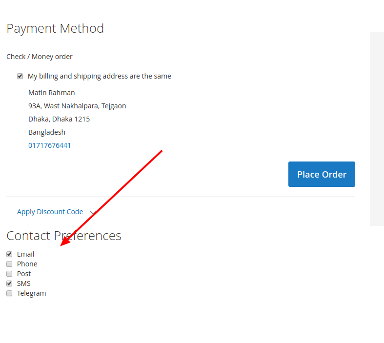
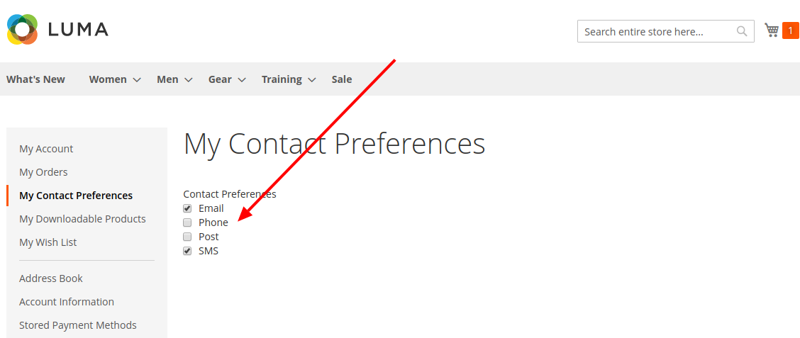
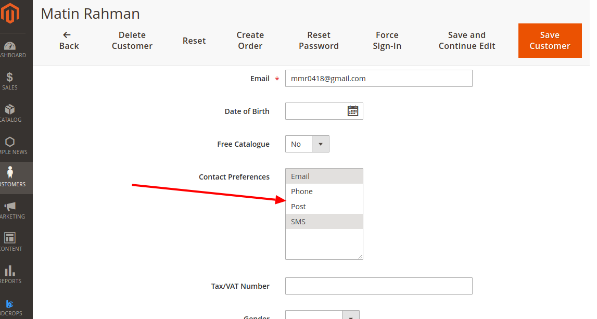
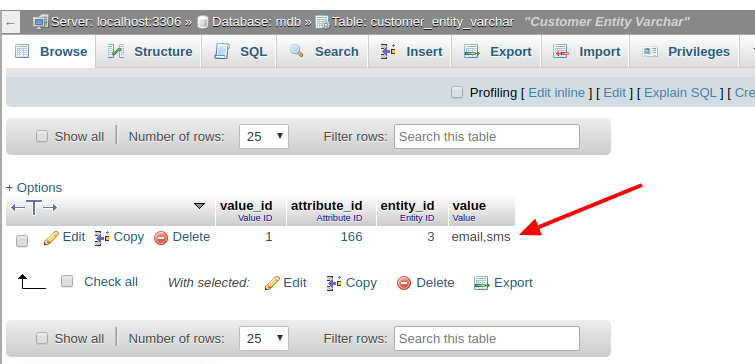

# Magento 2x ContactPreferences

This module is used as Customer Contact Preferences for all BDCrops Magento 2 extensions.understand the mechanism behind the customerData object and the section load, let's put it to use by creating a small module that adds contact preferences functionality under the customer's My Account area, as well as under the checkout.

Built a small module that allowed us to get a greater insight into Magento's customerData and sections mechanisms. We managed to build a single component, that got used both on the customer's My Account page, as well as on the checkout.

## Goal
- Adding contact preferences to customer accounts
- Manage CustomerData Entity in Magento 2
- use Section.xml file in Magento 2
- Customizing the Checkout Process
- Learn Magento 2 Certified Professional Developer exam topics "Customizing the Checkout Process 13%"


## 1. How to install & upgrade ContactPreferences


#### 1.1 Copy and paste

If you don't want to install via composer, you can use this way.

- Download [the latest version here](https://github.com/bdcrops/module-contactpreferences/archive/master.zip)
- Extract `master.zip` file to `app/code/BDC/ContactPreferences` ; You should create a folder path `app/code/BDC/ContactPreferences` if not exist.
- Go to Magento root folder and run upgrade command line to install `BDC_ContactPreferences`:

```
php bin/magento setup:upgrade
php bin/magento setup:static-content:deploy
```


#### 1.2 Install via composer

We recommend you to install BDC_ContactPreferences module via composer. It is easy to install, update and maintaince.Run the following command in Magento 2 root folder.

```
composer config repositories.module-contactpreferences git
https://github.com/bdcrops/module-contactpreferences.git

composer require bdcrops/module-contactpreferences:~1.0.0
php bin/magento setup:upgrade
php bin/magento setup:static-content:deploy
```

#### 1.3 Upgrade    

```
composer update bdcrops/module-contactpreferences
php bin/magento setup:upgrade
php bin/magento setup:static-content:deploy
```

Run compile if your store in Product mode:

```
php bin/magento setup:di:compile
```

## 2.  BDC_ContactPreferences

- create app/code/BDC/ContactPreferences/etc/module.xml
```
<?xml version="1.0"?>
<config xmlns:xsi="http://www.w3.org/2001/XMLSchema-instance" xsi:noNamespaceSchemaLocation="urn:magento:framework:Module/etc/module.xsd">
    <module name="BDC_ContactPreferences" setup_version="1.0.0">
        <sequence>
            <module name="Magento_Checkout"/>
        </sequence>
    </module>
</config>
```
- create app/code/BDC/ContactPreferences/registration.php
```
<?php

\Magento\Framework\Component\ComponentRegistrar::register(
    \Magento\Framework\Component\ComponentRegistrar::MODULE,
    'BDC_ContactPreferences',
    __DIR__
);
```
- create app/code/BDC/ContactPreferences/Setup/InstallData.php  
```
<?php

namespace BDC\ContactPreferences\Setup;

class InstallData implements \Magento\Framework\Setup\InstallDataInterface {
    protected $customerSetupFactory;

    public function __construct(
        \Magento\Customer\Setup\CustomerSetupFactory $customerSetupFactory
    ) {
        $this->customerSetupFactory = $customerSetupFactory;
    }

    public function install(\Magento\Framework\Setup\ModuleDataSetupInterface $setup, \Magento\Framework\Setup\ModuleContextInterface $context)
    {
        $setup->startSetup();
        $customerSetup = $this->customerSetupFactory->create(['setup' => $setup]);
        $customerSetup->addAttribute(
            \Magento\Customer\Model\Customer::ENTITY,
            'contact_preferences', [
                'type' => 'varchar',
                'label' => 'Contact Preferences',
                'input' => 'multiselect',
                'source' => \BDC\ContactPreferences\Model\Entity\Attribute\Source\Contact\Preferences::class,
                'required' => 0,
                'sort_order' => 99,
                'position' => 99,
                'system' => 0,
                'visible' => 1,
                'global' => \Magento\Catalog\Model\ResourceModel\Eav\Attribute::SCOPE_GLOBAL,
            ]
        );

        $contactPreferencesAttr = $customerSetup
            ->getEavConfig()->getAttribute(
                \Magento\Customer\Model\Customer::ENTITY,
                'contact_preferences'
            );

        $forms = [ 'adminhtml_customer', 'customer_account_edit', ];

        $contactPreferencesAttr->setData('used_in_forms', $forms)
            ->setData('is_used_for_customer_segment', true)
            ->setData('is_system', 0)
            ->setData('is_user_defined', 1)
            ->setData('is_visible', 1)
            ->setData('sort_order', 99);
        $contactPreferencesAttr->save();
        $setup->endSetup();
    }
}

```
- create app/code/BDC/ContactPreferences/etc/frontend/routes.xml
```
<?xml version="1.0"?>

<config xmlns:xsi="http://www.w3.org/2001/XMLSchema-instance" xsi:noNamespaceSchemaLocation="urn:magento:framework:App/etc/routes.xsd">
    <router id="standard">
        <route id="customer" frontName="customer">
            <module name="BDC_ContactPreferences" before="Magento_Customer"/>
        </route>
    </router>
</config>
```
- create app/code/BDC/ContactPreferences/Controller/Contact/Preferences.php
```
<?php

namespace BDC\ContactPreferences\Controller\Contact;

use Magento\Framework\App\Action\Context;
use phpDocumentor\Reflection\Types\Boolean;

class Preferences extends \Magento\Customer\Controller\AbstractAccount {
    protected $customerSession;
    protected $customerRepository;
    protected $logger;

    public function __construct(
        \Magento\Framework\App\Action\Context $context,
        \Magento\Customer\Model\Session $customerSession,
        \Magento\Customer\Api\CustomerRepositoryInterface $customerRepository,
        \Psr\Log\LoggerInterface $logger
    ) {
        $this->customerSession = $customerSession;
        $this->customerRepository = $customerRepository;
        $this->logger = $logger;
        parent::__construct($context);
    }

    public function execute() {
        if ($this->getRequest()->isPost()) {
            $resultJson = $this->resultFactory->create(\Magento\Framework\Controller\ResultFactory::TYPE_JSON);
            if ($this->getRequest()->getParam('load')) {
                // This POST is merely to trigger "contact_preferences" section load
            } else {
                try {
                    $preferences = implode(',',
                        array_keys(
                            array_filter($this->getRequest()->getParams(), function ($_checked, $_preference) {
                                return filter_var($_checked, FILTER_VALIDATE_BOOLEAN);
                            }, ARRAY_FILTER_USE_BOTH)
                        )
                    );
                    $customer = $this->customerRepository->getById($this->customerSession->getCustomerId());
                    $customer->setCustomAttribute('contact_preferences', $preferences);
                    $this->customerRepository->save($customer);
                    $this->messageManager->addSuccessMessage(__('Successfully saved contact preferences.'));
                } catch (\Exception $e) {
                    $this->logger->critical($e);
                    $this->messageManager->addSuccessMessage(__('Error saving contact preferences.'));
                }
            }
            return $resultJson;
        } else {
            $resultPage = $this->resultFactory->create(\Magento\Framework\Controller\ResultFactory::TYPE_PAGE);
            $resultPage->getConfig()->getTitle()->set(__('My Contact Preferences'));
            return $resultPage;
        }
    }
}

```
- create app/code/BDC/ContactPreferences/Model/Entity/Attribute/Source/Contact/Preferences.php
```
<?php

namespace BDC\ContactPreferences\Model\Entity\Attribute\Source\Contact;

class Preferences extends \Magento\Eav\Model\Entity\Attribute\Source\AbstractSource {
    const VALUE_EMAIL = 'email';
    const VALUE_PHONE = 'phone';
    const VALUE_POST = 'post';
    const VALUE_SMS = 'sms';
    const VALUE_TELEGRAM = 'telegram';

    public function getAllOptions() {
        return [
            ['label' => __('Email'), 'value' => self::VALUE_EMAIL],
            ['label' => __('Phone'), 'value' => self::VALUE_PHONE],
            ['label' => __('Post'), 'value' => self::VALUE_POST],
            ['label' => __('SMS'), 'value' => self::VALUE_SMS],
            ['label' => __('Telegram'), 'value' => self::VALUE_TELEGRAM],
        ];
    }
}
```

- create app/code/BDC/ContactPreferences/etc/frontend/di.xml
```
<?xml version="1.0"?>

<config xmlns:xsi="http://www.w3.org/2001/XMLSchema-instance" xsi:noNamespaceSchemaLocation="urn:magento:framework:ObjectManager/etc/config.xsd">
    <type name="Magento\Customer\CustomerData\SectionPoolInterface">
        <arguments>
            <argument name="sectionSourceMap" xsi:type="array">
                <item name="contact_preferences" xsi:type="string">BDC\ContactPreferences\CustomerData\Preferences</item>
            </argument>
        </arguments>
    </type>
</config>

```
- create app/code/BDC/ContactPreferences/CustomerData/Preferences.php
```
<?php

namespace BDC\ContactPreferences\CustomerData;

class Preferences extends \Magento\Framework\DataObject implements \Magento\Customer\CustomerData\SectionSourceInterface
{
    protected $preferences;
    protected $customerSession;

    public function __construct(
        \BDC\ContactPreferences\Model\Entity\Attribute\Source\Contact\Preferences $preferences,
        \Magento\Customer\Model\Session $customerSession,
        array $data = [] ) {
        $this->preferences = $preferences;
        $this->customerSession = $customerSession;
        parent::__construct($data);
    }

    public function getSectionData() {
        $existingPreferences = explode(',',
            $this->customerSession->getCustomer()->getContactPreferences()
        );

        $availablePreferences = [];

        foreach ($this->preferences->getAllOptions() as $_option) {
            $availablePreferences[] = [
                'label' => $_option['label'],
                'value' => $_option['value'],
                'checked' => in_array($_option['value'], $existingPreferences)
            ];
        }

        return [
            'selectOptions' => $availablePreferences,
            'isCustomerLoggedIn' => $this->customerSession->isLoggedIn()
        ];
    }
}

```
- create app/code/BDC/ContactPreferences/etc/frontend/sections.xml
```
<?xml version="1.0"?>

<config xmlns:xsi="http://www.w3.org/2001/XMLSchema-instance" xsi:noNamespaceSchemaLocation="urn:magento:module:Magento_Customer:etc/sections.xsd">
    <action name="customer/contact/preferences">
        <section name="contact_preferences"/>
    </action>
</config>

```


- create app/code/BDC/ContactPreferences/view/frontend/layout/checkout_index_index.xml
```
<?xml version="1.0"?>

<page xmlns:xsi="http://www.w3.org/2001/XMLSchema-instance" layout="1column"
      xsi:noNamespaceSchemaLocation="urn:magento:framework:View/Layout/etc/page_configuration.xsd">
    <body>
        <referenceBlock name="checkout.root">
            <arguments>
                <argument name="jsLayout" xsi:type="array">
                    <item name="components" xsi:type="array">
                        <item name="checkout" xsi:type="array">
                            <item name="children" xsi:type="array">
                                <item name="steps" xsi:type="array">
                                    <item name="children" xsi:type="array">
                                        <item name="billing-step" xsi:type="array">
                                            <item name="children" xsi:type="array">
                                                <item name="payment" xsi:type="array">
                                                    <item name="children" xsi:type="array">
                                                        <item name="afterMethods" xsi:type="array">
                                                            <item name="children" xsi:type="array">
                                                                <item name="contact-preferences" xsi:type="array">
                                                                    <item name="component" xsi:type="string">BDC_ContactPreferences/js/view/contact-preferences</item>
                                                                </item>
                                                            </item>
                                                        </item>
                                                    </item>
                                                </item>
                                            </item>
                                        </item>
                                    </item>
                                </item>
                            </item>
                        </item>
                    </item>
                </argument>
            </arguments>
        </referenceBlock>
    </body>
</page>

```


- create app/code/BDC/ContactPreferences/view/frontend/layout/customer_account.xml
```
<?xml version="1.0"?>

<page xmlns:xsi="http://www.w3.org/2001/XMLSchema-instance" xsi:noNamespaceSchemaLocation="urn:magento:framework:View/Layout/etc/page_configuration.xsd">
    <body>
        <referenceBlock name="customer_account_navigation">
            <block class="Magento\Customer\Block\Account\SortLinkInterface" name="customer-account-navigation-contact-preferences-link">
                <arguments>
                    <argument name="path" xsi:type="string">customer/contact/preferences</argument>
                    <argument name="label" xsi:type="string" translate="true">My Contact Preferences</argument>
                    <argument name="sortOrder" xsi:type="number">230</argument>
                </arguments>
            </block>
        </referenceBlock>
    </body>
</page>

```

- create app/code/BDC/ContactPreferences/view/frontend/layout/customer_contact_preferences.xml
```
<?xml version="1.0"?>

<page xmlns:xsi="http://www.w3.org/2001/XMLSchema-instance" xsi:noNamespaceSchemaLocation="urn:magento:framework:View/Layout/etc/page_configuration.xsd">
    <update handle="customer_account"/>
    <body>
        <referenceContainer name="content">
            <block name="contact_preferences"
                   template="BDC_ContactPreferences::customer/contact/preferences.phtml" cacheable="false"/>
        </referenceContainer>
    </body>
</page>

```
- create app/code/BDC/ContactPreferences/view/frontend/templates/customer/contact/preferences.phtml
```
<div class="contact-preferences" data-bind="scope:'contact-preferences-scope'">
    <!-- ko template: getTemplate() --><!-- /ko -->
</div>

<script type="text/x-magento-init">
    {
        ".contact-preferences": {
            "Magento_Ui/js/core/app": {
                "components": {
                    "contact-preferences-scope": {
                        "component": "contactPreferences"
                    }
                }
            }
        }
    }
</script>

```
- create app/code/BDC/ContactPreferences/view/frontend/requirejs-config.js
```
var config = {
    map: {
        '*': {
            contactPreferences: 'BDC_ContactPreferences/js/view/contact-preferences'
        }
    }
};

 ```
- create app/code/BDC/ContactPreferences/view/frontend/web/js/view/contact-preferences.js
```
define([
    'uiComponent',
    'jquery',
    'mage/url',
    'Magento_Customer/js/customer-data',
    'Magento_Customer/js/model/customer'
], function (Component, $, url, customerData, customer) {
    'use strict';

    let contactPreferences = customerData.get('contact_preferences');

    return Component.extend({
        defaults: {
            template: 'BDC_ContactPreferences/contact-preferences'
        },

        initialize: function () {
            this._super();

            // Trigger "contact_preferences" section load
            $.ajax({
                type: 'POST',
                url: url.build('customer/contact/preferences'),
                data: {'load': true},
                showLoader: true
            });
        },

        isCustomerLoggedIn: function () {
            return contactPreferences().isCustomerLoggedIn;
        },

        getSelectOptions: function () {
            return contactPreferences().selectOptions;
        },

        saveContactPreferences: function () {
            let preferences = {};

            $('.contact_preference').children(':checkbox').each(function () {
                preferences[$(this).attr('name')] = $(this).attr('checked') ? true : false;
            });

            $.ajax({
                type: 'POST',
                url: url.build('customer/contact/preferences'),
                data: preferences,
                showLoader: true,
                complete: function (response) {
                    // todo
                }
            });

            return true;
        }
    });
});

```
- create app/code/BDC/ContactPreferences/view/frontend/web/template/contact-preferences.html
```
<div class="contact-preferences-component" data-bind="if: isCustomerLoggedIn()">
    <div class="step-title iweb-contact-preferences-title" data-role="title" data-bind="i18n: 'Contact Preferences'"></div>
    <div class="contact-preferences" data-role="content">
        <div class="contact_preference" repeat="foreach: getSelectOptions(), item: '$option'">
            <input type="checkbox"
                   click="saveContactPreferences"
                   ko-checked="$option().checked"
                   attr="name: $option().value"/>
            <label text="$option().label" attr="for: $option().value"/>
        </div>
    </div>
</div>

```
- Result



##  FAQ

### What are exactly those sections ?

A section is a piece of customer data grouped together. Each section is represented by key that is used to access and manage data and data itself. Magento loads sections by AJAX request to /customer/section/load/ and caches loaded data in the browser local storage under the key mage-cache-storage. Magento tracks when some section is changed and load updated section automatically.

### How do you define a section ?

A section defined in di.xml file by adding a new section into sections pool
```
<type name="Magento\Customer\CustomerData\SectionPoolInterface">
    <arguments>
        <argument name="sectionSourceMap" xsi:type="array">
            <item name="cart" xsi:type="string">Magento\Checkout\CustomerData\Cart</item>
            <item name="directory-data" xsi:type="string">Magento\Checkout\CustomerData\DirectoryData</item>
        </argument>
    </arguments>
</type>
```
So here two new sections are registered cart and directory-data. Magento\Checkout\CustomerData\Cart and Magento\Checkout\CustomerData\DirectoryData implements Magento\Customer\CustomerData\SectionSourceInterface and provides actual data as result of getSectionData method.

### How are the section updates triggered ?

Magento assumes that customer's private data is changed when a customer sends some state modification request (POST, PUT, DELETE). To minimize the load on server, developers should specify which action (or request) updates which customer data section in etc/section.xml.
```
<action name="checkout/cart/add">
    <section name="cart"/>
</action>
```
Action name is an action key pattern. When a user calls to action that matches specified pattern Magento will detect that corresponding section is outdated and loads it again. If action name is * that means that section will be updated on each POST and PUT request. If section tag is missed then all section will be updated. So conceptually this is wrong to update mini cart when you rich cart page. At this point, mini cart (or cart section) already should be updated.

### How to Internal Implementation ?
To understand when and how sections are updated let's see implementation. Key to understanding are files magento2ce/app/code/Magento/Customer/view/frontend/web/js/section-config.js and magento2ce/app/code/Magento/Customer/view/frontend/web/js/customer-data.js.

At the end of last one of the two events handlers are registered for ajaxComplete and submit. That means that when any form is posted (with POST or PUT methods) to server, or when JavaScript sends an AJAX, POST or PUT request, the handlers will be invoked. Both handlers have similar logic: with help of Magento_Customer/js/section-config check should be any section updated or not. If some section should be updated then customerData.invalidate(sections) is called. And later all invalidated sections are loaded from a server.

So how does Magento_Customer/js/section-config know which section should be removed and on which action? The answer is in Magento/Customer/view/frontend/templates/js/section-config.phtml:
```
<script type="text/x-magento-init">
<?php
     /* @noEscape */ echo $this->helper(\Magento\Framework\Json\Helper\Data::class)->jsonEncode([
    '*' => ['Magento_Customer/js/section-config' => [
        'sections' => $block->getSections(),
        'clientSideSections' => $block->getClientSideSections(),
        'baseUrls' => array_unique([
            $block->getUrl(null, ['_secure' => true]),
            $block->getUrl(null, ['_secure' => false]),
        ]),
    ]],
]);
?>
</script>
```
In such way, a server passes merged sections configuration to a browser.
### How  section may be updated only by POST or PUT form submitting or AJAX request?

In addition, there are only two notes:

all described here is internal implementation and may be changed, so you may safely use only sections.xml and expect section updates when specified POST or PUT or DELETE actions are triggered.
if you sure, that you really need update some section you can always do something like this:
```
 require('Magento_Customer/js/customer-data').reload(['cart'], false)
 ```

### What is Section.xml file in Magento 2?
With the growing use of the internet and technology, several changes & enhancement happen into design, layout, and code to provide a better & a richer experience to the users. Also, Magento moved smartly with concepts like knockout js, AJAX other add ons that allows web applications to send and retrieve data from a server asynchronously without refreshing or reloading. This technique helps reducing server request and saves time by reloading only one portion or section of the webpage.
For example, we have one extension in Magento 2 that offers Ajax login functionality and we want to restore old cart items once a user successfully login to their account. To do the same we only need to refresh a mini cart only, not the whole page.
By default, Magento 2 creates a small group of data and each group has a unique name/key. So, if we want to refresh a particular section we can use its group key to refresh data. In all new Magento 2, it stores data at both hands, so we also need to update local storage data of browser if we want to refresh a particular portion.

### How to implementing Section.xml file in Magento 2?

To do the same, first you need to create “di.xml” at this path.
app\code\Vendor\Extension\etc\di.xml
To do the same, first you need to create “di.xml” at this path.
app\code\Vendor\Extension\etc\di.xml
```
<type name="Magento\Customer\CustomerData\SectionPoolInterface">
	<arguments>
    	<argument name="sectionSourceMap" xsi:type="array">
        	<item name="cart" xsi:type="string">Magento\Checkout\CustomerData\Cart</item>
        	<item name="directory-data" xsi:type="string">Magento\Checkout\CustomerData\DirectoryData</item>
    	</argument>
	</arguments>
</type>
```
Now, in above code we just register cart and directory-data in customer Data section. For that we need to create section.xml using below code at this path.
app\code\Vendor\Extension\etc\frontend\section.xml
```
<?xml version="1.0"?>
<config xmlns:xsi="http://www.w3.org/2001/XMLSchema-instance"
        xsi:noNamespaceSchemaLocation="urn:magento:module:Magento_Customer:etc/sections.xsd">
	<action name="routername/controller/action">
    	<section name="cart"/>
	</action>
</config>
```
So, now whenever we call action like “ajaxlogin/index/getlogin” Magento will consider the current cart section is outdated and it re-initialize the cart section.
You can also refresh the cart section on each request, by using * instead of action.

### Explain Customer Data Management in Magento 2?

It happens that you are frequently facing asynchronous customer data loading while working with Magento 2. For example cart reloading, checkout, logging and user log in and some others are working through AJAX. In order to work with these data, Magento development team provides with a proper interface, that we are going to overview now.

Interface of the current module consists of js-module, which is uploaded by RequireJs and from backend interface that allows sending data by AJAX. Let’s consider a template for name displaying in default Magento 2 theme.Customer’s name is displayed by this code implemented:
```
<span data-bind="text: new String('<?php echo $block->escapeHtml(__('Welcome, %1!', '%1'));?>').replace('%1', customer().firstname)">
```
As you can see in the following code the template is replaced by customer().firstname object property. And in the code below, you will see what customer object is related to:
```
<script type="text/x-magento-init">
        {
            "*": {
                "Magento_Ui/js/core/app": {
                    "components": {
                        "customer": {
                            "component": "Magento_Customer/js/view/customer"
                        }
                    }
                }
            }
        }
</script>
```

You can find out more about js-scripts and modules connection syntax in the following article: “JavaScript Integration Tips in Magento 2“.

As you can see, customer object is created in Magento_Customer/js/view/customer.js file:
```
define([
   'uiComponent',
   'Magento_Customer/js/customer-data'
], function (Component, customerData) {
   'use strict';

   return Component.extend({
       initialize: function () {
           this._super();
           this.customer = customerData.get('customer');
       }
   });
});
```

It follows that the current code returns Component object (the definition of uiComponent we will cover in the next article) with overridden initialize method. All the magic of data uploading from server is performed right in this method. Please pay your attention at the string:

this.customer = customerData.get('customer');
1
this.customer = customerData.get('customer');
Where customerData is a RequireJs module and it’s been initialized in Magento_Customer/js/customer-data.js.

Here is what we know at the moment: information about customers data we are getting from customerData.get(‘customer’) object. And we can transfer not only “customer”, but other parameters as well into get method.

But then we have a few questions regarding customerData use:

where to get data
what parameters could be transferred into customerData.get();
is it possible to add your own parameters into customerData.get();
So, let’s consider all of them one after another.

If you enable debug mode in your browser and try to add a product to the cart, then you will notice a pretty usual behavior: there are several AJAX queries are sent to a server. But if you reload the page, you will see that initially the cart is empty, but during the page is being loaded the cart will be reloaded and all the previously added products will appear in it. This cart behavior tells us about asynchronous cart data loading, after the main page is loaded.

However, if you enable debugger you probably won’t see AJAX queries to the server. But we just saw that data was uploaded from somewhere, and please don’t forget that data should not come with the main page, because it may cause problems with enabled FPC. Basically, we are getting a conclusion that data should be uploaded from somewhere, but definitely not from AJAX. So we might think that they are stored in a browser. And it’s true.

If you take a look at Application->Local Storage (for Chrome browser) tab you will see these data:


Please take a look at “mage-cache-storage” section. All the data that can be used in customerData objects are stored in the particular section. If you delete this section and then reload a page, you will notice that all products in a cart are gone. And they will appear only in case you reload the current section one more time and add one more product to the cart.

Mage-cache-storage section structure is a regular JSON object, on which upper level we have a name of parameter, that we can transfer to get method of customerData object. Thus we finally handled with a structure of customerData, but we still have a question: from where all these data appeared in a browser, and what code is related to these data.

If you add one more product to the cart, you’ll be able to see such server query:

https://url_base/customer/section/load/?sections=cart%2Cmessages&update_section_id=true&_=1478514106235
1
https://url_base/customer/section/load/?sections=cart%2Cmessages&update_section_id=true&_=1478514106235
As it follows from URL, we address to Magento\Customer\Controller\Section\Load controller with such parameters: sections=cart%2Cmessages&update_section_id=true. That is a controller we need, and it’s responsible for data update. In such manner we are able to update any sections.

Also, you can create a section on your own and use it according to your needs. You just have to register your section, by the following manipulations in di.xml file:
```
<type name="Magento\Customer\CustomerData\SectionPoolInterface">
    <arguments>
        <argument name="sectionSourceMap" xsi:type="array">
            <item name="your_module_data" xsi:type="string">\YourCompany_YourModule\Order\Plugin\Section</item>
        </argument>
    </arguments>
</type>
```
In the following code, the class \YourCompany_YourModule\Order\Plugin\Section should perform Magento\Customer\CustomerData\SectionSourceInterface interface. So now it’s really easy to get an access to the required information:
```
var dataObject = customerData.get('your_module_data');
var data = dataObject();
 ```
dataObject – it is the object, that returns ko.observable() method, so it’s rather easy to embed this object into knokountJs templates. Just execute the following command, to update data in browser storage  for a certain section:
```
customerData.reload(['your_module_data']))
```

CustomerData provides with several very useful methods for data processing, let’s specify them:

get(section) – please see above;
set(section,data) – data inserting;
reload(sections) – data reload;
invalidate(section) – puts a remark about invalid data, and that is necessary to reload them.
It’s all fine until this moment, but a problem with data validity managing appeared because we perform many operations, that are trying to modify data all the time. So we should control these data. One of the possible solution – is to hang an event on the actions, connected with changes. But don’t you think it’s very tiresome and errors search takes too much time. For this reason, Magento Development Team invented a very original method of data validity control. Let’s take a look more in details at Magento_Customer/js/customer-data.js file (this is the module, that initializes customerData), more specifically at these strings:

```
$(document).on('ajaxComplete', function (event, xhr, settings) {
        var sections,
            redirects;

        if (settings.type.match(/post|put/i)) {
            sections = sectionConfig.getAffectedSections(settings.url);

            if (sections) {
                customerData.invalidate(sections);
                redirects = ['redirect', 'backUrl'];

                if (_.isObject(xhr.responseJSON) && !_.isEmpty(_.pick(xhr.responseJSON, redirects))) {
                    return;
                }
                customerData.reload(sections, true);
            }
        }
    });
 ```

    As you can see there is a function, hanged on ajaxComplete event in document object, and this function constantly compares URL address and that’s why URL selects those sections that should be updated. It’s a very useful mechanism of data validity control. We can add some sections, that will be updated upon transition to a certain URL. For that purpose we should add sections.xml file to etc/frontend directory in our module:
```
<config xmlns:xsi="http://www.w3.org/2001/XMLSchema-instance"
       xsi:noNamespaceSchemaLocation="urn:magento:module:Magento_Customer:etc/sections.xsd">
   <action name="braintree/paypal/placeOrder">
       <section name="cart"/>
       <section name="checkout-data"/>
   </action>
</config>
```

This example we got from braintree module and we notice, that cart section and checkout-data section will be overloaded after AJAX-query (post, put) with URL address braintree/paypal/placeOrder is executed. It stands to mention that there are sections, like message, that are being updated upon request for any URL, that’s why when you use ajax-queries in your modules, bear in mind that except of your request, at least one more will be executed, which will update sections. You can use GET method instead of POST, to escape this. In spite of seeming complexity, after you mastered it, you are getting very flexible tool for data and ajax-queries management.


##  Ref
- [stackexchange](https://magento.stackexchange.com/questions/112948/magento-2-how-do-customer-sections-sections-xml-work)
- [magecomp](https://magecomp.com/blog/use-section-xml-file-magento-2/)
- [belvg](https://belvg.com/blog/customer-data-management-in-magento-2.html)
